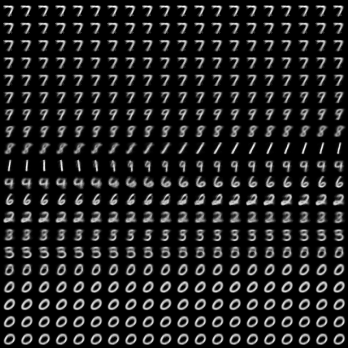
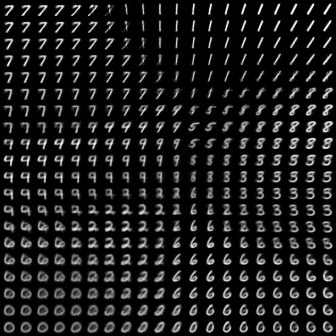

# Generative Model Implementation

Here contains VAE and GAN implementation.

## VAE

To run visualization in 1-d latent space, run the following code

```bash
python vae.py model=vae1
```

or 2-d latent space

```bash
python vae.py model=vae2
```





```

```


## GAN

To run GAN in MNIST,

```bash
python gan.py model=GAN
```
